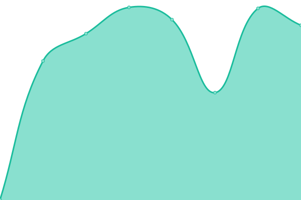
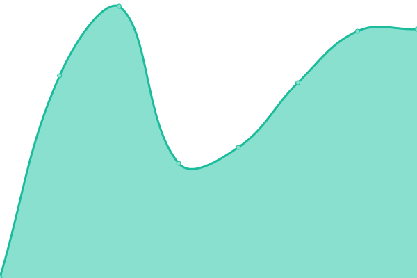
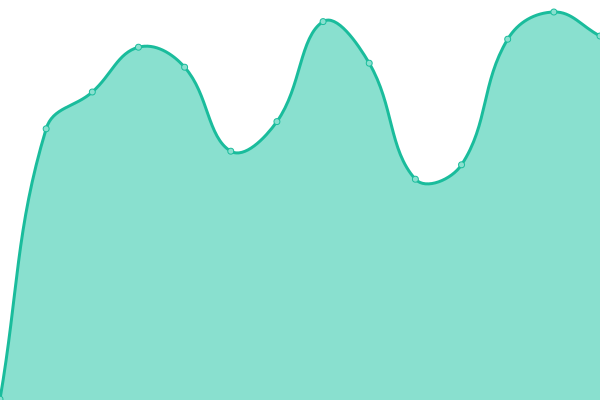
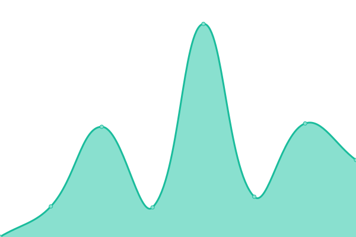
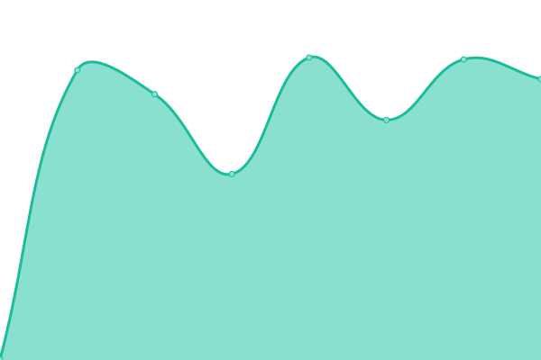

# [📈 Live Status](https://status.evia.network): <!--live status--> **🟧 Partial outage**

This repository contains the open-source uptime monitor and status page for [Upptime](https://upptime.js.org), powered by [Upptime](https://github.com/upptime/upptime).

With [Upptime](https://upptime.js.org), you can get your own unlimited and free uptime monitor and status page, powered entirely by a GitHub repository. We use [Issues](https://github.com/upptime/upptime/issues) as incident reports, [Actions](https://github.com/max-evia/max-evia.github.io/actions) as uptime monitors, and [Pages](https://status.evia.network) for the status page.

<!--start: status pages-->
<!-- This summary is generated by Upptime (https://github.com/upptime/upptime) -->
<!-- Do not edit this manually, your changes will be overwritten -->
<!-- prettier-ignore -->
| URL | Status | History | Response Time | Uptime |
| --- | ------ | ------- | ------------- | ------ |
|  [Evia Network Website](https://www.evia.network) | 🟩 Up | [evia-network-website.yml](https://github.com/max-evia/max-evia.github.io/commits/HEAD/history/evia-network-website.yml) | 

 1218ms
     
 | 

<a href="https://status.evia.network/history/evia-network-website">100.00%</a>
    

|  [Evia Network DApp](https://app.evia.network) | 🟩 Up | [evia-network-d-app.yml](https://github.com/max-evia/max-evia.github.io/commits/HEAD/history/evia-network-d-app.yml) | 

 223ms
     
 | 

<a href="https://status.evia.network/history/evia-network-d-app">100.00%</a>
    

|  [Evia CosmoDash](https://cosmodash.evia.network) | 🟩 Up | [evia-cosmo-dash.yml](https://github.com/max-evia/max-evia.github.io/commits/HEAD/history/evia-cosmo-dash.yml) | 

 225ms
     
 | 

<a href="https://status.evia.network/history/evia-cosmo-dash">100.00%</a>
    

|  [Evia Network Docs](https://docs.evia.network) | 🟩 Up | [evia-network-docs.yml](https://github.com/max-evia/max-evia.github.io/commits/HEAD/history/evia-network-docs.yml) | 

 455ms
     
 | 

<a href="https://status.evia.network/history/evia-network-docs">100.00%</a>
    

|  [Evia Network DApp API](https://api.propel.evianetwork.com) | 🟥 Down | [evia-network-d-app-api.yml](https://github.com/max-evia/max-evia.github.io/commits/HEAD/history/evia-network-d-app-api.yml) | 

 399ms
     
 | 

<a href="https://status.evia.network/history/evia-network-d-app-api">99.38%</a>
    

|  [Evia CosmoDash API](https://api.cosmodash.evia.network) | 🟩 Up | [evia-cosmo-dash-api.yml](https://github.com/max-evia/max-evia.github.io/commits/HEAD/history/evia-cosmo-dash-api.yml) | 

 373ms
     
 | 

<a href="https://status.evia.network/history/evia-cosmo-dash-api">99.83%</a>
    

|  [KitKat Website](https://www.kitkat.zone) | 🟩 Up | [kit-kat-website.yml](https://github.com/max-evia/max-evia.github.io/commits/HEAD/history/kit-kat-website.yml) | 

 367ms
     
 | 

<a href="https://status.evia.network/history/kit-kat-website">100.00%</a>
    

|  [KitKat Explorer](https://explorer.kitkat.zone) | 🟩 Up | [kit-kat-explorer.yml](https://github.com/max-evia/max-evia.github.io/commits/HEAD/history/kit-kat-explorer.yml) | 

 63ms
     
 | 

<a href="https://status.evia.network/history/kit-kat-explorer">100.00%</a>
    

|  [KitKat Faucet API](https://api.faucet.kitkat.zone) | 🟩 Up | [kit-kat-faucet-api.yml](https://github.com/max-evia/max-evia.github.io/commits/HEAD/history/kit-kat-faucet-api.yml) | 

 400ms
     
 | 

<a href="https://status.evia.network/history/kit-kat-faucet-api">100.00%</a>
    

<!--end: status pages-->

[**Visit our status website →**](https://status.evia.network)

## 📄 License

- Powered by: [Upptime](https://github.com/upptime/upptime)
- Code: [MIT](./LICENSE) © [Upptime](https://upptime.js.org)
- Data in the `./history` directory: [Open Database License](https://opendatacommons.org/licenses/odbl/1-0/)
